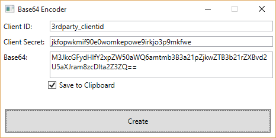

# Base64
[Base64 encoder](https://eveonline-third-party-documentation.readthedocs.org/en/latest/sso/authentication/) for [EVE CREST API applications](https://developers.eveonline.com/applications)

